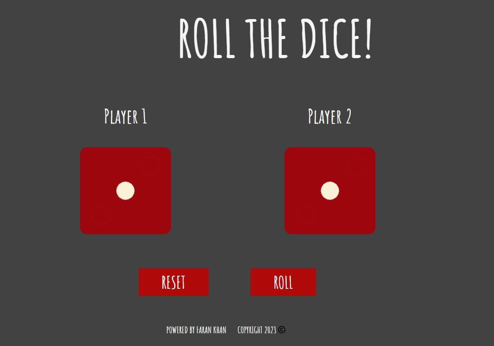
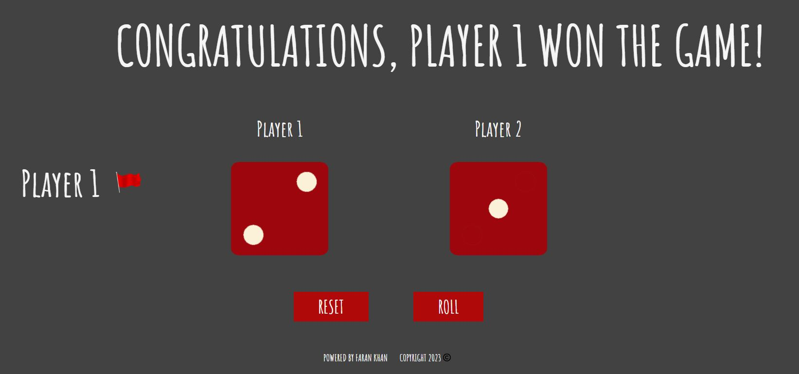

# 🎲 The Dice Game

**The Dice Game** is a fun and simple web project. When the page reloads (or is refreshed), **two dice faces update randomly**, and the side with the **higher number wins**. It’s a quick, lightweight game that lets users test their luck!

---

## ✨ Features

- 🎯 Two dice representing Player 1 and Player 2
- 🔁 Dice faces update with every **page reload**
- 🏆 Displays the winner based on the higher number rolled
- 💡 Simple logic powered by random image switching
- 💻 Clean and responsive layout

---

## 🌐 Directly Visit Website

Ready to roll the dice? Check out the live version here:

[The Dice Game](https://farankhan125.github.io/The-Dice-Game/)

---

## 🛠️ Tech Stack

- **HTML5**
- **CSS3**
- **JavaScript (Vanilla)**

---

## 🚀 Getting Started

You can run this project locally in just a few steps:

1. **Clone the repository**
```bash
git clone https://github.com/farankhan125/The-Dice-Game.git
```
2. **Navigate to the project folder**
```bash
cd The-Dice-Game
```
3. **Open the folder in your IDE**
```bash
code -a .
```
4. **Open index.html in your browser**
```bash
start index.html
```

That's it! 🎉 No build tools or dependencies required.

---

## 📸 Demo Preview




---

## 🧑‍💻 Contributing

Got ideas to improve the design or add animations? Feel free to fork and contribute!

1. **Fork the project**  
Forking the repository is the first step to make a copy of the project under your account.

Click Here: [The Dice Game](https://github.com/farankhan125/The-Dice-Game)

2. **Clone your forked repository (replace your username with yourUsername in the command below)**
```bash
git clone https://github.com/yourUsername/The-Dice-Game.git
```
3. **Navigate into the project folder**
```bash
cd The Dice Game
```
4. **Open the folder in your IDE**
```bash
code -a .
```
5. **Create your feature branch**
```bash
git checkout -b feature/your-new-feature-name-here
```
6. **Stage the changes**
```bash
git add .
```
7. **Make your changes and commit**
```bash
git commit -m "Improve dice UI or add animation"
```
8. **Push to the branch**
```bash
git push origin feature/your-new-feature-name-here
```
9. **Open a Pull Request**  

Go to your fork on GitHub, and you'll see a prompt to "Compare & pull request" — click that and submit your PR!

---

## 📄 License

This project is licensed under the MIT License — feel free to use and modify it.

---

## 📬 Contact
Made with ❤️ by Faran Khan  
GitHub: @farankhan125
